<p align="center">
  
</p>

High-throughput reinforcement-learning search and sampling in Rust, with caller-owned
Python networks and training.

Reinfors runs game dynamics, search, episode orchestration, and batch assembly in a
parallel Rust backend. Your inference callback is the boundary: it receives pooled NumPy
observations and returns model outputs, so the network, framework, optimizer, replay,
hardware placement, and distributed topology remain yours.

Benchmarked against OpenSpiel's all-C++ libtorch AlphaZero on a matched chess training
workload — two-hour rounds at each stack's best measured configuration, then
head-to-head play between the resulting models — reinfors sustained **9.9% higher
training throughput**, and its trained networks scored **0.605 ± 0.020** against
OpenSpiel's over 300 paired games (**+74 Elo**). Protocol, evidence, and full results:
[reinfors-benchmarks](https://github.com/jeepjeepjeep/reinfors-benchmarks).

Reinfors is not designed to maximize throughput at any cost or to outperform a bespoke, fully
fused JAX/XLA pipeline on the fixed workload it specializes for. It targets a practical balance:
native simulation, search, and batching, while games, algorithms, networks, and deployment remain
modular enough for broad experimentation.

```python
import numpy as np
import reinfors as rf

game = rf.games.Connect4()
engine = rf.Engine(
    game=game,
    reward=rf.Reward(win=1.0, loss=-1.0),
    policy=rf.policies.Mcts(num_simulations=64),
    learner=rf.learners.TreeStrap(),
    n_games=32,  # parallel episode slots
    seed=0,
)

actions = game.action_space().n

def infer(obs: np.ndarray) -> np.ndarray:
    # Replace with PyTorch, JAX, an accelerator service, or any other backend.
    return np.zeros((len(obs), 1, actions), dtype=np.float32)

batch = engine.collect(n_records=1024, infer=infer)
print(batch.obs.shape, batch.targets.shape, batch.telemetry)
```

## Why reinfors?

- Search and sampling are native, multithreaded, and batch network requests across games
  and search leaves.
- `collect` supports a simple synchronous loop; `collect_stream` runs parallel Rust search
  concurrently with Python training, with configurable queueing and bounded backpressure.
- Networks are injectable per player and are not tied to a framework or device topology.
- [`Arena`](docs/guides/arena.md) runs paired evaluation matches across concurrent slots, pooling
  native search while subprocess-backed external agents compute on bounded worker lanes.
- Composable Rust traits make new games and algorithms straightforward to add, with safer,
  simpler native extension than comparable C++ infrastructure.
- [Game semantics](docs/catalogue/games.md) cover single- and multi-agent, zero-sum,
  cooperative, and general-sum tasks; one-shot and multi-step environments; turn-taking or
  simultaneous decisions; explicit chance; and perfect or imperfect information.
- Algorithms span policy-driven value learning, search-guided learning, and standalone
  game-theoretic solving; see the [algorithm catalogue](docs/catalogue/algorithms.md) for current
  implementations.
- Resolved configurations, snapshots, structured batches, and telemetry support
  reproducible experiments.

## Install

```bash
pip install reinfors
```

Optional adapters and training dependencies are separate:

```bash
pip install "reinfors[gym]"   # Gymnasium and PettingZoo adapters
pip install "reinfors[train]" # PyTorch examples
```

Contributing or building from source? See the [development setup guide](docs/development/setup.md).

## Where next?

- [Get started](docs/getting-started.md)
- [Understand sampling and injectable training](docs/concepts/sampling-and-training.md)
- [Choose a game](docs/catalogue/games.md), [algorithm](docs/catalogue/algorithms.md), or
  [built-in composition](docs/catalogue/compatibility.md)
- [Run the examples](docs/examples/index.md)
- [Evaluate searched agents with Arena](docs/guides/arena.md)
- [Add a Rust game or algorithm](docs/extending/index.md)
- [Read the complete documentation](docs/index.md)

## Stability

reinfors is pre-1.0: **any 0.x release may change any API, behavior, or serialized format**
(including snapshot and config layouts) without deprecation. Pin an exact version
(`reinfors==0.x.y`) and read release notes when upgrading. What does hold at every version:
constructors validate their inputs, and no public Python input reaches a Rust panic — both
enforced by adversarial test sweeps in CI.

## Citation

If you use reinfors in your research, cite it via the repository's
[CITATION.cff](CITATION.cff) (GitHub's "Cite this repository" button renders it
as BibTeX/APA). What reinfors itself builds on is catalogued in
[References](docs/reference/references.md).

## License

Licensed under either of [MIT](LICENSE-MIT) or [Apache-2.0](LICENSE-APACHE), at your
option. Unless you explicitly state otherwise, any contribution intentionally submitted
for inclusion in this work shall be dual-licensed as above, without any additional terms
or conditions.
