# Evaluation and interactive play

Use the evaluation path that matches the trained object:

| What you have | Evaluation path | Maintained example |
| --- | --- | --- |
| Deployed search policy | Concurrent paired matches through `Arena` | [Arena evaluation](arena.md#run-the-maintained-example) |
| Raw policy or network | Referee games through `Env` | [AlphaZero head-to-head example](../examples/index.md#alphazero-head-to-head) |
| Tabular CFR strategy | Solver value and best-response metrics | [CFR solving example](../examples/index.md#solve-leduc) |
| Scripted or human agent | Direct action selection through `Env` | [Terminal Connect4 example](../examples/index.md#play-connect4) |

## Compare deployed search policies

`Arena` runs the native policy used by training, pools search leaves across concurrent games, swaps
seats over paired openings, and reports pair-level uncertainty. It can compare two searched
contestants or one searched contestant against a subprocess or scripted external agent. See the
[Arena guide](arena.md) for the complete example, concurrency controls, external-agent lifecycle,
results, and current limits.

## Compare raw networks

`Env` is the referee: it owns one game and its chance stream, while the caller chooses each action.
The maintained AlphaZero example loads two checkpoints, alternates their seats, samples several
opening moves for diversity, and reports the first model's win/draw score:

```bash
python examples/train_alphazero_example.py --iterations 40 --seed 0 --save a.pt
python examples/train_alphazero_example.py --iterations 40 --seed 1 --save b.pt
python examples/eval_az_h2h.py a.pt b.pt --games 200 --opening-plies 4
```

The two 40-iteration training commands are real CPU search workloads: expect minutes rather than
seconds on a typical laptop, with the exact time printed at completion. The search-free referee is
usually much faster. For a quick plumbing check, use fewer training iterations and `--games 20`;
those settings are not enough for a meaningful strength comparison.

The referee deliberately uses the networks' raw policy heads. Use `Arena` instead when search is part
of the agent being evaluated, and report the complete search configuration with the result.

## Evaluate a DQN greedily

For a DQN, evaluate by taking the highest-Q legal action through `Env`. Network outputs use the
encoder's head frame, while `Env` uses game-action ids. Follow the
[action-frame contract](../reference/glossary.md#action-frames) when an encoder transforms actions:

```python
encoder = rf.encoders.RelativeChess()
game = rf.games.Chess(encoder=encoder)
env = rf.Env(game, reward=rf.Reward(win=1.0, loss=-1.0, draw=0.0), seed=0)
env.reset()

while not env.done():
    (agent,) = env.active_agents()
    q_values = evaluate_q_network(env.observe(agent))  # One value per encoder-head action.
    legal_game_actions = env.legal_actions(agent)
    action = max(
        legal_game_actions,
        key=lambda game_id: q_values[encoder.head_index(game_id, agent)],
    )
    env.step({agent: action})
```

`evaluate_q_network` represents the caller's checkpoint loading, tensor conversion, and forward
pass. For an ensemble, choose or aggregate its heads before the legal argmax.

For credible comparisons:

- alternate or randomize seats from a recorded seed;
- disable self-play exploration noise unless it is part of the evaluated agent;
- report draws and uncertainty, not only a mean score;
- record the resolved game configuration, model identifiers, and seeds;
- introduce controlled opening diversity for deterministic games.

`env.fork()` creates an independent environment at the same state. With no seed it preserves the
future chance stream; with a new seed it explores a different future. This supports paired action
comparisons and counterfactual probes.

## Evaluate CFR strategies

Tabular CFR exposes its average strategy, expected values, best-response values, NashConv, and
exploitability directly. Run the complete Leduc/Kuhn workflow with:

```bash
python examples/solve_leduc.py --game leduc_poker --variant plus --iterations 1000
```

The script trains the solver, prints exploitability checkpoints and the average-profile value, and
can persist the tables with `--save`. Exact metrics are subject to the canonical
[enumeration limits](../reference/limits.md#enumeration-limits). For N-player games, NashConv
remains a distance-from-equilibrium diagnostic, but the two-player exploitability interpretation
does not carry over unchanged.

## Play Connect4 in a terminal

The maintained interactive example renders Connect4's inspection state, accepts columns `1`–`7`
from standard input, validates them against `env.legal_actions()`, and plays a seeded random
opponent. Pass `--opponent human` for two-player input or enter `q` to stop:

```bash
python examples/play_connect4.py
```



Rendering is game-specific: this example formats `env.state()["board"]`, whereas agents should act
from `env.observe()`. `state()` is trusted inspection data and can expose hidden information in games
such as poker, so never use it as an agent input.

## Drive an environment directly

For debugging, scripted opponents, or interactive play, choose legal actions yourself:

```python
import random
import reinfors as rf

rng = random.Random(0)
env = rf.Env(rf.games.Connect4(), seed=0)

while not env.done():
    actions = {
        agent: rng.choice(env.legal_actions(agent))
        for agent in env.active_agents()
    }
    events = env.step(actions)
    if events:
        print(events)
```

Sequential games expose one active agent; simultaneous games may expose several. One `step` is a
tick and returns the ordered event trace from its action and any following chance chain. If the
environment has a reward mapping, `env.rewards` contains the most recent tick's per-agent rewards.

## Standard adapters

The [adapter guide](adapters.md) covers Gymnasium, PettingZoo AEC, and PettingZoo Parallel
construction, rewards, action masks, and truncation behavior.

## Next steps

- Find the maintained referee and solver scripts in the [examples catalogue](../examples/index.md).
- Evaluate deployed search configurations with the [Arena guide](arena.md).
- Preserve evaluated model/configuration pairs with
  [configuration and checkpoints](configuration-and-checkpoints.md).
- Log arena returns, lengths, seeds, and model versions in the caller. `Env` does not produce Engine
  telemetry.
